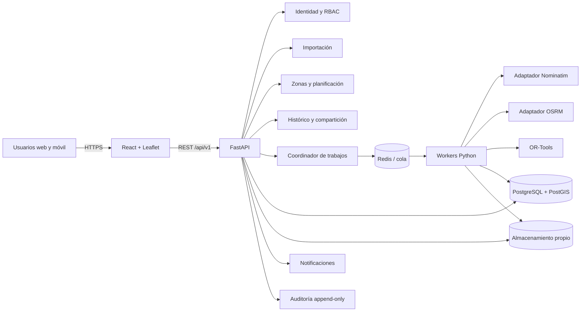
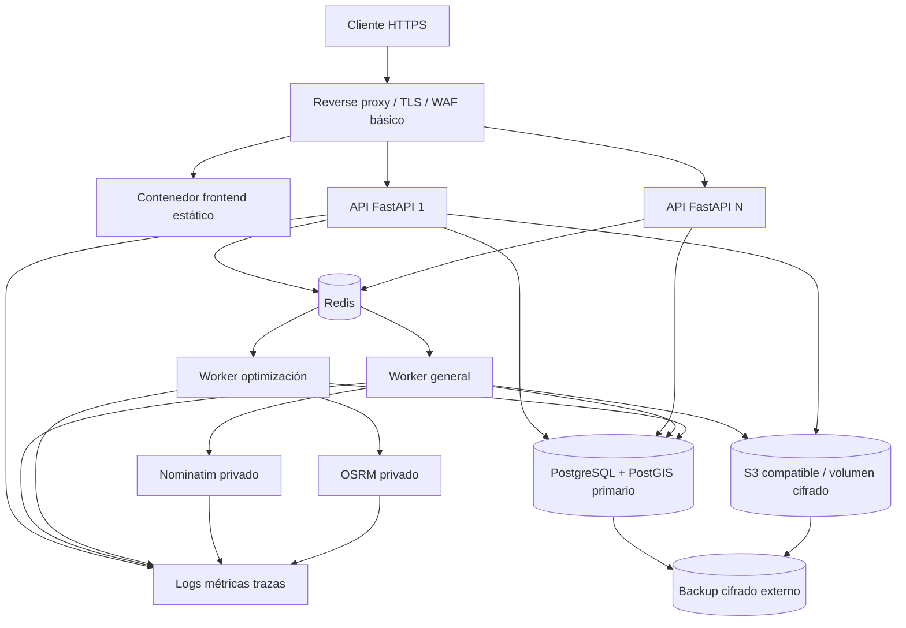
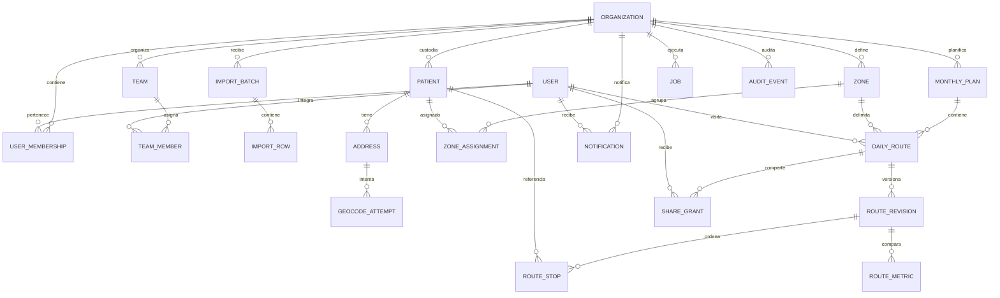
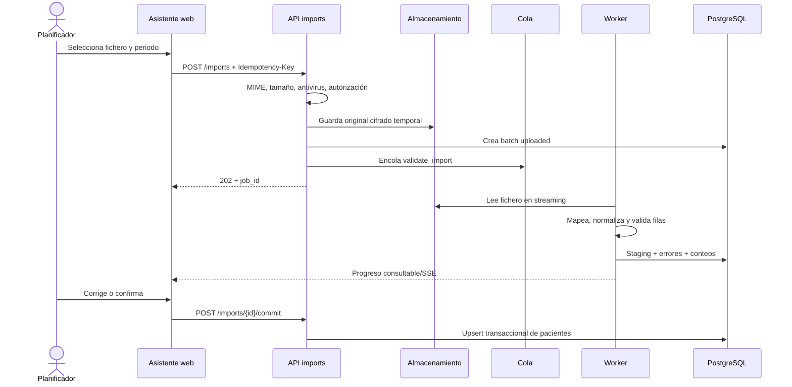
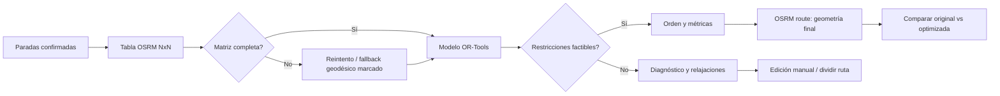

# Diseño técnico — Aplicación de rutas de visitas domiciliarias

| Campo | Valor |
|---|---|
| Proyecto | App de Planificación y Optimización de Rutas de Visitas Domiciliarias |
| Versión | 1.0 |
| Fecha | 2026-08-29 |
| Estado | Diseño para revisión técnica y jurídica |
| Requisitos base | [Requisitos de la aplicación](../requisitos/requisitos-app-rutas-pacientes.md) |
| Propuesta base | [Propuesta técnica y funcional](../propuesta/propuesta-app-rutas-pacientes.md) |
| Dataset de contexto | [Direcciones ficticias de Bizkaia](../requisitos/direcciones-ejemplo-bizkaia.csv) |

## 1. Propósito, alcance y principios

### 1.1 Propósito

Este documento define cómo implementar una aplicación web que importe listados mensuales de pacientes, valide y geocodifique sus direcciones, proponga zonas, distribuya visitas en días laborables, optimice rutas diarias y mantenga histórico y compartición controlada. Convierte los requisitos RF-01 a RF-30 y RNF-01 a RNF-11 en componentes, contratos, datos y verificaciones concretas.

### 1.2 Alcance

Se incluye importación `.xlsx`, `.xls` y CSV; mapa Leaflet/OpenStreetMap; geocodificación Nominatim; zonificación automática y manual; planificación mensual y diaria; matrices OSRM; optimización OR-Tools TSP/VRP; histórico; exportación; notificaciones; RBAC; auditoría y enlaces externos protegidos.

Quedan fuera de la primera versión la navegación giro a giro, tráfico en tiempo real, facturación, datos clínicos e integración con historia clínica. La exportación hacia una app de navegación es una salida, no una integración clínica ni un canal autorizado para enviar nombres de pacientes.

### 1.3 Supuestos y restricciones

- Volumen nominal: 200 pacientes por carga mensual; máximo inicial: 500 filas por fichero.
- Ruta diaria típica: 15-20 paradas; máximo soportado y probado: 25.
- Dataset de diseño: 120 registros ficticios, 79 municipios, 64 direcciones urbanas y 56 rurales, delimitados por `;`. Contiene pisos y acentos, códigos postales repetidos entre municipios y direcciones rurales poco estructuradas; por ello no se considera la dirección textual una identidad estable.
- Una organización puede tener varios equipos. Toda entidad de negocio queda aislada por `organization_id`.
- Los horarios se almacenan en UTC y se presentan en `Europe/Madrid`; una fecha de visita pertenece a la zona horaria de la organización.
- Nominatim, OSRM, PostgreSQL/PostGIS, almacenamiento y workers se autoalojan para producción. Las instancias públicas solo sirven para desarrollo manual de bajo volumen bajo sus políticas vigentes.
- Los proveedores de pago quedan desactivados por defecto y solo pueden habilitarse por configuración, contrato, evaluación de privacidad y aprobación explícita del responsable.
- Los controles aquí descritos apoyan privacidad y seguridad, pero no garantizan por sí solos cumplimiento del RGPD/LOPDGDD. El responsable del tratamiento y asesoría jurídica deben validar base legitimadora, EIPD, RAT, contratos, plazos y atención de derechos.

### 1.4 Convenciones de trazabilidad

- `RF-nn` y `RNF-nn` remiten al documento de requisitos.
- Cada operación que cambia planificación incrementa una versión y emite auditoría.
- Una ruta publicada es un snapshot inmutable; los cambios crean una revisión nueva para preservar el histórico.
- Los criterios porcentuales del documento base, como el 95% de geocodificación o el 15-20% de ahorro, son objetivos de aceptación a medir, no garantías algorítmicas.

## 2. Decisiones arquitectónicas

| ID | Decisión | Alternativas | Tradeoff y justificación |
|---|---|---|---|
| ADR-01 | Monolito modular FastAPI/Python con workers separados | NestJS; microservicios desde el inicio | Python integra de forma directa pandas/openpyxl, Shapely, scikit-learn y OR-Tools. Un monolito modular reduce despliegues y transacciones distribuidas al volumen previsto. Los workers escalan independientemente; los límites de módulo permiten extraer servicios si las métricas lo justifican. |
| ADR-02 | React + TypeScript, Leaflet y diseño responsive | Aplicación nativa; Mapbox/Google como base | Una SPA cubre escritorio y campo con un único cliente. Leaflet/OSM evita licencias por llamada. No se promete uso offline de teselas públicas. |
| ADR-03 | REST JSON bajo `/api/v1` y OpenAPI | GraphQL | Los recursos, trabajos y errores son predecibles; REST simplifica idempotencia, caché, auditoría y clientes externos. |
| ADR-04 | PostgreSQL 17 + PostGIS como sistema de registro | NoSQL; geometría solo en aplicación | Integridad relacional, índices geoespaciales, consultas de proximidad y transacciones en una sola plataforma. El cifrado de campos sensibles se aplica además del cifrado de volumen. |
| ADR-05 | Redis + cola de trabajos compatible con Python | Ejecución síncrona; broker complejo | Importación, geocodificación, matrices, optimización y exportación exceden una petición HTTP. Redis aporta cola, locks y rate limiting con menor operación; si se requiere garantía de mensajería superior se migrará a RabbitMQ manteniendo la interfaz de jobs. |
| ADR-06 | Adaptadores `Geocoder`, `Router`, `Optimizer`, `TileProvider` y `ObjectStore` | Invocar proveedores desde controladores | Cumple RNF-10, permite autoalojamiento y fallback aprobado, y hace posibles dobles de prueba. Añade interfaces, pero evita dependencia transversal. |
| ADR-07 | Nominatim y OSRM autoalojados con extracto de Euskadi/norte peninsular | APIs públicas; proveedor de pago | Elimina datos personales en terceros y límites incompatibles con lotes. Exige RAM, disco, actualizaciones OSM y observabilidad propias. |
| ADR-08 | Snapshots versionados para rutas publicadas | Actualizar rutas en sitio | Favorece trazabilidad, comparación planificado/ejecutado y auditoría. Consume más almacenamiento, mitigado con retención y deduplicación de artefactos. |
| ADR-09 | Seudónimo operativo y dirección cifrada por campo | Nombre completo en toda la aplicación | Minimiza exposición. La operativa puede mostrar referencia y dirección solo a roles y rutas autorizadas; la seudonimización sigue siendo dato personal y no equivale a anonimización. |
| ADR-10 | Optimización en dos etapas: matriz OSRM + OR-Tools | Heurística propia; orden por distancia lineal | Usa red viaria real y un solver probado. Puede no hallar solución con restricciones incompatibles; el sistema devuelve diagnóstico y admite relajación/manual. |
| ADR-11 | Ejecución 100% en contenedores Docker en todos los entornos (dev/staging/producción) mediante Docker Compose | Instalación directa sobre el host; Kubernetes desde el inicio | Reproducibilidad, paridad dev/prod y despliegue con `docker compose up` sin PaaS de pago. Kubernetes queda como evolución futura si la escala lo justifica, sin cambiar el empaquetado en contenedores. |

## 3. Arquitectura lógica



### 3.1 Límites de módulo backend

| Módulo | Responsabilidad | No debe hacer |
|---|---|---|
| `identity` | Sesiones, usuarios, roles, equipos, políticas de autorización | Conocer reglas de rutas |
| `imports` | Recepción segura, parseo, mapeo de columnas, validación, deduplicación y staging | Publicar pacientes inválidos |
| `geocoding` | Normalización, caché, Nominatim, candidatos, confianza y corrección manual | Seleccionar automáticamente candidatos ambiguos |
| `zoning` | Features geográficas, clustering, capacidad, clasificación urbana/rural y override | Modificar planes publicados |
| `planning` | Calendario, capacidad, asignación, restricciones y versiones | Calcular la matriz viaria directamente |
| `routing` | Cliente OSRM, matriz de tiempo/distancia, geometría y caché | Decidir permisos o retención |
| `optimization` | Modelo TSP/VRP, objetivos, límites, diagnóstico y comparativa | Persistir datos sensibles fuera de repositorios |
| `history` | Snapshots, ejecución de paradas, filtros y exportaciones | Sobrescribir una revisión publicada |
| `sharing` | ACL interna, tokens externos, expiración, revocación y vistas minimizadas | Exponer identificadores o direcciones por defecto |
| `notifications` | Outbox y entrega in-app/email sin datos sensibles | Ser fuente del estado de negocio |
| `audit` | Eventos inmutables de acceso/cambio/exportación/compartición | Guardar secretos o valores completos innecesarios |
| `jobs` | Estado, progreso, reintentos, cancelación e idempotencia | Implementar lógica de dominio |

### 3.2 Módulos frontend

| Área | Responsabilidad y estados clave |
|---|---|
| Acceso | Inicio/cierre de sesión, renovación segura, error 401/403 y selección de organización autorizada |
| Asistente de importación | Carga, mapeo de columnas, prevalidación, progreso, tabla de errores descargable y reanudación |
| Bandeja de geocodificación | Candidatos, confianza, mapa de confirmación, edición textual y colocación manual del marcador |
| Mapa operativo | Capas de pacientes/zonas/rutas, clustering visual, leyenda, filtros y detalle sujeto a permisos |
| Editor de zonas | Parámetros, propuesta, arrastrar/reasignar, capacidad y confirmación versionada |
| Calendario | Vista mensual/diaria, capacidad, conflictos, asignación de visitador y drag-and-drop accesible con alternativa de formulario |
| Optimizador | Objetivo, origen/retorno, restricciones, progreso, diagnóstico y comparación base/optimizada |
| Ruta de campo | Orden, mapa, ventana horaria, estado completada/no completada y funcionamiento tolerante a reconexión sin almacenar teselas públicas offline |
| Histórico | Búsqueda por fecha/zona/usuario/referencia, comparación plan/ejecución y acceso a snapshots |
| Compartición | Usuarios, permiso, caducidad, revocación, vista previa minimizada y confirmación de riesgo externo |
| Administración | Usuarios, equipos, parámetros, proveedores, retención y consulta de auditoría |

El frontend no decide autorización: oculta acciones por ergonomía, pero cada petición se autoriza de nuevo en backend.

## 4. Arquitectura de despliegue



### 4.1 Contenedores y redes

- **Toda la aplicación se ejecuta en contenedores Docker en los tres entornos (desarrollo, staging y producción)**: frontend, API, workers, PostgreSQL/PostGIS, Redis, Nominatim y OSRM son siempre imágenes Docker, sin excepción y sin instalación directa sobre el host. Docker Compose orquesta desarrollo y piloto de una sola máquina; producción usa Docker Compose (o Swarm si se requiere multi-nodo) separando datos, API/workers y servicios OSM al menos por redes y volúmenes. Kubernetes no es requisito inicial, pero cualquier evolución de orquestador debe seguir empaquetando los mismos componentes como contenedores.
- Solo el reverse proxy publica puertos. PostgreSQL, Redis, Nominatim, OSRM y almacenamiento permanecen en red privada.
- Imágenes fijadas por digest, usuario no root, filesystem de solo lectura donde sea viable, secretos montados desde gestor externo y escaneo de dependencias en CI.
- Nominatim y OSRM usan extractos OSM versionados. La actualización se prepara en paralelo, se valida con rutas de referencia y se conmuta de forma controlada.
- Alta disponibilidad objetivo del 99% en horario laboral: dos réplicas de API (como contenedores independientes), health checks, reinicio automático, backups verificados y capacidad degradada documentada. Una única base de datos sin réplica puede ser aceptable en piloto, no para el objetivo definitivo.

## 5. Modelo de dominio

### 5.1 Agregados y reglas

| Agregado | Raíz | Invariantes |
|---|---|---|
| Carga mensual | `ImportBatch` | Hash de fichero único por organización y mes salvo reimportación explícita; una fila no pasa a operativa sin validación mínima |
| Paciente operativo | `Patient` | `external_ref` único por organización; no almacena dato clínico; una dirección activa por visita planificable en v1 |
| Zona | `Zone` | Capacidad positiva; asignaciones automáticas pueden sobrescribirse manualmente con motivo |
| Plan mensual | `MonthlyPlan` | Mes, equipo y versión únicos; solo planes validados pueden publicarse |
| Ruta diaria | `DailyRoute` | Fecha, zona, visitador y revisión; una parada pertenece a una sola ruta activa por fecha |
| Compartición | `ShareGrant` | Permiso `view` o `edit`; sujeto interno o token externo, nunca ambos; revocable y auditable |

Estados principales:

- `ImportBatch`: `uploaded → validating → requires_correction|validated → geocoding → ready|failed|cancelled`.
- `Geocode`: `pending → matched|ambiguous|not_found|manual`.
- `MonthlyPlan`: `draft → validating → published → archived`; publicar genera snapshots.
- `DailyRoute`: `draft → optimizing → ready → published → in_progress → completed|cancelled`; editar una publicada crea revisión en `draft`.
- `Job`: `queued → running → succeeded|failed|cancelled`; un fallo reintentable puede volver a `queued`.

## 6. Modelo relacional



### 6.1 Tablas, claves y restricciones

Todas las PK son UUIDv7 para orden temporal sin revelar conteos. Todas las tablas multi-tenant incluyen `organization_id UUID NOT NULL`; las FK compuestas o políticas RLS impiden referencias cruzadas entre organizaciones.

| Tabla | Columnas relevantes | Claves, relaciones y restricciones |
|---|---|---|
| `organizations` | `id`, `name`, `timezone`, `retention_months`, `cost_per_km`, `cost_per_hour`, `created_at` | PK `id`; `retention_months >= 1` |
| `users` | `id`, `email_normalized`, `display_name`, `password_hash/oidc_subject`, `status`, `mfa_enabled` | PK; UNIQUE `email_normalized`; nunca guardar tokens en claro |
| `user_memberships` | `organization_id`, `user_id`, `role`, `created_at` | PK compuesta; FK a organización/usuario; `role` en `admin,planner,field,supervisor` |
| `teams` | `id`, `organization_id`, `name`, `active` | UNIQUE `(organization_id,name)` |
| `team_members` | `team_id`, `user_id` | PK compuesta; consistencia de organización |
| `import_batches` | `id`, `organization_id`, `period`, `filename`, `file_sha256`, `status`, `mapping_json`, `counts_json`, `created_by`, timestamps | UNIQUE parcial `(organization_id,period,file_sha256)` para cargas no canceladas |
| `import_rows` | `id`, `batch_id`, `row_number`, `raw_json_encrypted`, `normalized_hash`, `validation_status`, `errors_json`, `patient_id` | UNIQUE `(batch_id,row_number)`; el hash excluye espacios/caso pero no sustituye revisión humana |
| `patients` | `id`, `organization_id`, `external_ref`, `display_ref`, `status`, `source_batch_id`, timestamps | UNIQUE `(organization_id,external_ref)`; sin información clínica |
| `addresses` | `id`, `organization_id`, `patient_id`, `address_ciphertext`, `postal_code`, `municipality`, `province`, `location geography(Point,4326)`, `geocode_status`, `confidence`, `is_active`, `version` | Una activa por paciente mediante índice UNIQUE parcial; latitud/longitud derivadas de `location`; optimistic lock `version` |
| `geocode_attempts` | `id`, `address_id`, `provider`, `query_hash`, `candidate_json_minimized`, `result_location`, `score`, `outcome`, `requested_at`, `reviewed_by` | No persistir respuesta completa del proveedor si contiene datos innecesarios |
| `zones` | `id`, `organization_id`, `name`, `kind`, `max_visits`, `boundary geometry(MultiPolygon,4326)`, `centroid geography(Point,4326)`, `version` | UNIQUE `(organization_id,name)`; `kind in (urban,rural,mixed)` |
| `zone_assignments` | `zone_id`, `patient_id`, `source`, `score`, `valid_from`, `valid_to`, `override_reason` | UNIQUE parcial por paciente para asignación vigente; `source in (cluster,postal,manual)` |
| `monthly_plans` | `id`, `organization_id`, `team_id`, `period`, `status`, `version`, `constraints_json`, `created_by`, `published_at` | UNIQUE `(organization_id,team_id,period,version)` |
| `daily_routes` | `id`, `organization_id`, `plan_id`, `zone_id`, `service_date`, `assignee_id`, `status`, `current_revision`, `version` | UNIQUE `(plan_id,service_date,zone_id,assignee_id)`; FK de usuario perteneciente a organización |
| `route_revisions` | `id`, `route_id`, `revision`, `objective`, `origin`, `destination`, `solver_status`, `constraints_json`, `osrm_dataset_version`, `created_by`, `created_at`, `published_at` | UNIQUE `(route_id,revision)`; una publicada no se modifica |
| `route_stops` | `id`, `revision_id`, `patient_id`, `address_snapshot_ciphertext`, `location`, `sequence`, `service_minutes`, `window_start`, `window_end`, `status`, `completed_at`, `failure_reason` | UNIQUE `(revision_id,sequence)` y `(revision_id,patient_id)`; ventana válida; estado de ejecución actualizado con versión |
| `route_metrics` | `revision_id`, `variant`, `distance_m`, `travel_seconds`, `service_seconds`, `estimated_cost`, `calculation_json` | PK `(revision_id,variant)`; `variant in (original,optimized,actual)` |
| `share_grants` | `id`, `organization_id`, `route_id`, `subject_user_id`, `permission`, `token_hash`, `expires_at`, `revoked_at`, `created_by`, `last_accessed_at` | CHECK sujeto XOR token; solo hash de token; externos: expiración obligatoria en diseño base |
| `jobs` | `id`, `organization_id`, `type`, `resource_type`, `resource_id`, `idempotency_key`, `status`, `progress`, `attempt`, `error_code`, `result_json`, timestamps | UNIQUE `(organization_id,type,idempotency_key)`; payload sin dirección en claro |
| `notifications` | `id`, `organization_id`, `recipient_id`, `type`, `resource_id`, `status`, `created_at`, `sent_at` | Índice por receptor/estado; contenido sensible se consulta tras autenticación |
| `audit_events` | `id`, `organization_id`, `actor_id`, `action`, `resource_type`, `resource_id`, `outcome`, `ip_hash`, `metadata_json`, `occurred_at`, `prev_hash`, `event_hash` | Append-only; encadenado de hashes para evidenciar manipulación; acceso restringido |

### 6.2 Índices

- GiST en `addresses.location`, `zones.boundary`, `zones.centroid` y `route_stops.location`.
- B-tree en todas las FK y en `daily_routes(service_date, assignee_id, status)`.
- B-tree en `monthly_plans(organization_id, period, status)` y `jobs(status, created_at)`.
- Parcial en `geocode_attempts(address_id, requested_at DESC)` para outcomes no resueltos.
- GIN en `import_rows.errors_json` solo si los filtros operativos lo requieren; evitar indexar JSON por defecto.
- B-tree en `audit_events(organization_id, occurred_at DESC)`, `(resource_type,resource_id,occurred_at)` y `share_grants(token_hash)`.
- Búsqueda de paciente por `external_ref`/`display_ref`; no se habilita búsqueda global por dirección descifrada. Si fuera imprescindible, usar hash ciego normalizado con análisis de riesgo.

## 7. Flujos principales

### 7.1 Importación Excel/CSV



Validaciones: extensión y firma real; límite de tamaño y 500 filas; hoja seleccionable; cabeceras obligatorias/mapeables; celdas como texto; fórmula rechazada o evaluada de forma segura; referencia requerida; dirección, CP, municipio y provincia; CP español de cinco dígitos; duplicados internos y contra periodo; longitud y caracteres; ausencia de macros; errores por fila con código, campo y propuesta. La carga no es todo-o-nada: las filas válidas quedan en staging, pero el usuario confirma explícitamente qué filas publicar.

### 7.2 Validación y geocodificación

1. Normalizar para búsqueda sin destruir el original: Unicode, espacios, abreviaturas controladas, piso/puerta separados, provincia y país añadidos.
2. Consultar caché por hash de dirección normalizada + versión de proveedor/dataset.
3. Nominatim autoalojado devuelve hasta cinco candidatos dentro de un bounding box configurable para Bizkaia/Euskadi.
4. Puntuar coincidencia de calle/número, CP, municipio, provincia, clase y distancia al centro esperado. Umbral alto y diferencia suficiente con segundo candidato permiten `matched`; el resto queda `ambiguous` o `not_found`.
5. El planificador puede editar la dirección, elegir candidato o fijar marcador. Toda corrección registra autor, motivo, valor anterior protegido y precisión `manual`.
6. Nunca enviar nombre/referencia de paciente al geocodificador. Solo dirección mínima necesaria. Una instancia pública no debe recibir direcciones reales/confidenciales.

Fallback: reintento exponencial ante 429/5xx; simplificación controlada de piso/portal; búsqueda por CP+municipio; revisión manual. Un proveedor de pago solo se usa si está habilitado para la organización, hay base contractual/jurídica y el usuario autorizado aprueba el envío. No se acepta automáticamente una coordenada de centroide municipal como domicilio; puede mostrarse como ayuda de revisión.

### 7.3 Zonificación

1. Excluir direcciones sin coordenadas confirmadas.
2. Generar features: coordenadas proyectadas, municipio/CP, densidad local, tipo rural/urbano y tiempo aproximado al depósito.
3. Semilla por municipio/CP cuando conserve continuidad; clustering capacitado para cumplir `max_visits` y número objetivo de zonas.
4. Para áreas densas usar K-means capacitado sobre coordenadas proyectadas; para dispersión rural preferir clustering jerárquico o DBSCAN/HDBSCAN para detectar outliers. K-means puro no respeta carreteras ni densidades irregulares.
5. Evaluar cohesión con distancia viaria OSRM en una segunda pasada y mover bordes si reduce tiempo sin romper capacidad.
6. Mostrar propuesta, outliers y capacidad. Todo movimiento manual prevalece en regeneraciones salvo que el planificador decida resetear overrides.

Fallback: si faltan matrices, agrupar por municipio/CP y distancia geodésica; si un punto queda aislado, crear zona de excepción o asignarlo manualmente. Ningún cluster se publica sin validación visual del planificador.

### 7.4 Planificación mensual y diaria

- Construir días laborables desde calendario configurable, festivos y disponibilidad de equipo.
- Calcular capacidad por día considerando máximo de visitas, duración de servicio, jornada, zona rural/urbana y ventanas.
- Asignar primero visitas con ventana estrecha y zonas rurales; después balancear carga y minimizar cambios de zona por día.
- Validar conflictos: paciente duplicado, visitador no disponible, ventana fuera de jornada, capacidad/tiempo excedidos, dirección no confirmada.
- El solver de asignación puede proponer; el planificador conserva edición manual. Cada drag/drop llama a un comando versionado y devuelve conflictos antes de confirmar.
- Publicar bloquea la versión, crea revisiones de ruta y notifica asignaciones mediante outbox transaccional.

### 7.5 Optimización TSP/VRP



- OSRM `/table` produce matrices dirigidas de segundos y metros para origen, paradas y retorno. Se cachea por hash de coordenadas redondeadas, perfil y versión del extracto; el redondeo no sustituye las coordenadas autorizadas del snapshot.
- Sin ventanas y un vehículo se modela TSP. Con ventanas, duración de visita, jornada o varios visitadores se usa VRP/VRPTW.
- Objetivo tiempo: minimizar viaje + penalizaciones configuradas. Objetivo coste: `distancia_km × coste_km + horas_viaje × coste_hora`; la duración de atención se informa pero no cambia por orden.
- Se fija límite del solver inferior al SLA, por ejemplo 10 segundos dentro de los 15 segundos totales. Se conserva la mejor solución factible y `optimality_gap/status`; nunca etiquetar como óptimo matemático si OR-Tools solo obtuvo solución factible.
- La ruta original usa el orden importado o manual y la misma matriz, para comparación justa.
- Inalcanzables OSRM bloquean publicación hasta corregir, excluir con motivo o aprobar fallback marcado. Distancia Haversine sirve para propuesta/degradación, no para una estimación vial silenciosa.
- Inviabilidad: explicar ventanas incompatibles, jornada insuficiente o parada aislada; ofrecer ampliar ventana, dividir ruta, retirar parada o editar orden. Las restricciones duras no se relajan sin confirmación.

### 7.6 Histórico y ejecución

- Publicar crea un snapshot de dirección, coordenada, orden, restricciones, métricas, geometría, parámetros del solver y versiones OSRM/OSM.
- El visitador actualiza una parada mediante `PATCH` idempotente y control `If-Match`; conflictos 409 muestran el estado más reciente.
- El histórico consulta snapshots, no el paciente actual, para reproducibilidad. La visualización aplica permisos y retención vigentes.
- Métricas reales solo usan datos reportados; no se infiere localización continua del usuario en v1.
- La purga elimina/anonimiza referencias según política, conserva auditoría mínima legalmente justificada y genera acta técnica. Cualquier conservación legal debe configurarse y justificarse fuera de este diseño.

### 7.7 Compartición

- Compartición interna: ACL por usuario con `view`/`edit`; la edición exige además rol compatible y ruta no inmutable.
- Enlace externo: token aleatorio de al menos 256 bits, solo su hash en BD, caducidad obligatoria, revocación, rate limit y vista minimizada. El token va en fragmento o se canjea por sesión corta para reducir exposición en logs/referrers.
- Por defecto, la vista externa oculta nombre/referencia, portal/piso y estados sensibles; muestra únicamente lo aprobado. Compartir direcciones de pacientes con externos requiere una política y validación jurídica específicas.
- Cada creación, acceso, fallo, exportación y revocación emite auditoría. No incluir datos personales en email; enviar aviso y enlace autenticado.

## 8. Diseño de API

### 8.1 Convenciones

- Base `/api/v1`; JSON UTF-8; IDs UUID; fechas ISO 8601; paginación por cursor; filtro y orden explícitos.
- OAuth2/OIDC recomendado; access token corto en cookie `HttpOnly`, `Secure`, `SameSite=Lax/Strict` según flujo; protección CSRF para comandos con cookie.
- `Idempotency-Key` obligatorio en importación, commit, optimización, publicación, exportación y compartición. El servidor guarda hash de petición y respuesta; reutilizar clave con payload distinto devuelve 409.
- `ETag`/`If-Match` para zonas, planes, rutas y paradas; escritura sobre versión antigua devuelve 409.
- Correlación mediante `X-Request-ID`, generado por servidor si falta. Nunca contiene identificadores de paciente.
- Trabajos largos devuelven `202 Accepted`, `job_id`, `status_url` y `Retry-After`. Progreso por polling; SSE es opcional y no es fuente única.

Formato de error:

```json
{
  "type": "https://app.example/errors/validation",
  "title": "Datos no válidos",
  "status": 422,
  "code": "IMPORT_ROW_INVALID",
  "detail": "Hay filas que requieren corrección",
  "instance": "/api/v1/imports/019...",
  "request_id": "req_...",
  "errors": [{"row": 14, "field": "postal_code", "code": "INVALID_FORMAT"}]
}
```

Códigos comunes: 400 sintaxis/estado imposible, 401 no autenticado, 403 no autorizado, 404 recurso no visible, 409 versión/idempotencia/conflicto, 413 fichero grande, 415 formato, 422 dominio, 429 límite, 503 dependencia temporal, 504 timeout. Un 404 puede sustituir a 403 para evitar enumeración.

### 8.2 Endpoints de identidad y configuración

| Método y ruta | Entrada resumida | Respuesta | Errores relevantes |
|---|---|---|---|
| `GET /me` | — | Usuario, roles, equipos y capacidades | 401 |
| `GET /users?role=&team=` | Cursor/filtros | Usuarios visibles minimizados | 403 |
| `POST /users` | Email, rol, equipos | 201 usuario | 409 email; 422 rol |
| `PATCH /users/{id}` | Estado, rol, equipos + `If-Match` | Usuario actualizado | 403/409 |
| `GET /settings/routing` | — | Proveedor activo, costes y límites no secretos | 403 |
| `PATCH /settings/routing` | Costes, objetivo por defecto, proveedor permitido | Configuración versionada | 403/409/422 |

### 8.3 Importación y geocodificación

| Método y ruta | Entrada resumida | Respuesta | Errores relevantes |
|---|---|---|---|
| `POST /imports` | Multipart: fichero, periodo, equipo, mapeo opcional | 202 batch + job | 413/415/422/409 |
| `GET /imports/{id}` | — | Estado, progreso, conteos, enlace de errores | 404 |
| `GET /imports/{id}/rows?status=` | Cursor | Filas minimizadas y errores | 403/404 |
| `PATCH /imports/{id}/rows/{row}` | Campos corregidos + versión | Fila revalidada | 409/422 |
| `POST /imports/{id}/validate` | Opciones de mapeo | 202 job | 409 estado |
| `POST /imports/{id}/commit` | Filas aceptadas, estrategia duplicados | 202 job/resultados | 409/422 |
| `POST /imports/{id}/geocode` | Filas elegibles | 202 job | 409/422/503 |
| `GET /addresses/{id}/candidates` | — | Candidatos minimizados + score | 404 |
| `POST /addresses/{id}/geocode-selection` | Candidate ID o `{lat,lon,reason}` | Dirección confirmada | 409/422 |

Ejemplo de creación:

```json
{
  "id": "019...",
  "status": "uploaded",
  "job": {"id": "019...", "status": "queued", "status_url": "/api/v1/jobs/019..."}
}
```

### 8.4 Zonas y planificación

| Método y ruta | Entrada resumida | Respuesta | Errores relevantes |
|---|---|---|---|
| `POST /zone-proposals` | Batch/periodo, número, capacidad, estrategia | 202 job | 422 geocodes/capacidad |
| `GET /zone-proposals/{id}` | — | Zonas, asignaciones, outliers y métricas | 404/409 |
| `POST /zones` | Nombre, tipo, capacidad, geometría opcional | 201 zona | 409/422 |
| `PATCH /zones/{id}` | Campos + `If-Match` | Zona versionada | 409/422 |
| `PUT /zones/{id}/patients/{patientId}` | `{reason}` | 204 asignación manual | 409 capacidad |
| `POST /plans` | Periodo, equipo, calendario, restricciones | 201 borrador | 409/422 |
| `POST /plans/{id}/generate` | Estrategia y pesos | 202 job | 409/422 |
| `GET /plans/{id}` | Incluye versión | Calendario, conflictos y métricas | 404 |
| `PATCH /plans/{id}/visits/{patientId}` | Fecha, zona, assignee + `If-Match` | Plan actualizado/conflictos | 409/422 |
| `POST /plans/{id}/validate` | — | Conflictos y avisos | 409 |
| `POST /plans/{id}/publish` | Versión y confirmaciones | 202 publicación | 409/422 |

### 8.5 Rutas, histórico y ejecución

| Método y ruta | Entrada resumida | Respuesta | Errores relevantes |
|---|---|---|---|
| `POST /routes/{id}/optimize` | Objetivo, origen/retorno, restricciones, versión | 202 job | 409/422/503/504 |
| `GET /routes/{id}` | Revisión opcional | Ruta, paradas, geometría y permisos | 403/404 |
| `GET /routes/{id}/comparison` | — | Métricas original/optimizada y ahorro | 404/409 |
| `PATCH /routes/{id}/stops/order` | IDs ordenados + `If-Match` | Revisión manual y métricas pendientes | 409/422 |
| `POST /routes/{id}/publish` | Revisión | Snapshot publicado | 409/422 |
| `PATCH /routes/{id}/stops/{stopId}` | Estado, hora, motivo + `If-Match` | Parada actualizada | 409/422 |
| `GET /history/routes?from=&to=&zone=&assignee=&patient_ref=` | Cursor/filtros | Snapshots autorizados | 403/422 |
| `POST /routes/{id}/exports` | `format: pdf|png|navigation_link`, revisión | 202 job o enlace corto | 409/422 |
| `GET /jobs/{id}` | — | Estado, progreso, error/resultados | 404 |
| `POST /jobs/{id}/cancel` | — | 202 cancelación solicitada | 409 no cancelable |

Ejemplo de optimización:

```json
{
  "objective": "cost",
  "origin": {"lat": 43.2630, "lon": -2.9350},
  "return_to_origin": true,
  "costs": {"eur_per_km": 0.32, "eur_per_hour": 21.0},
  "solver_time_limit_seconds": 10
}
```

Respuesta final del job:

```json
{
  "route_id": "019...",
  "revision": 3,
  "solver_status": "feasible",
  "metrics": {
    "original": {"distance_m": 68400, "travel_seconds": 5910, "estimated_cost": 56.43},
    "optimized": {"distance_m": 54100, "travel_seconds": 4720, "estimated_cost": 44.58}
  },
  "warnings": []
}
```

### 8.6 Compartición, notificaciones y auditoría

| Método y ruta | Entrada resumida | Respuesta | Errores relevantes |
|---|---|---|---|
| `POST /routes/{id}/shares` | Usuario o externo, permiso, expiración, campos visibles | 201 grant; token solo una vez si externo | 403/409/422 |
| `GET /routes/{id}/shares` | — | Grants sin token | 403 |
| `DELETE /shares/{id}` | — | 204 revocado | 403/404 |
| `POST /public-shares/exchange` | Token | Cookie/sesión efímera y vista minimizada | 401/404/410/429 |
| `GET /notifications` | Cursor/estado | Notificaciones | 401 |
| `PATCH /notifications/{id}` | `read: true` | 204 | 404 |
| `GET /audit-events?resource_type=&resource_id=&from=&to=` | Cursor/filtros | Eventos minimizados | 403 |

## 9. Seguridad, privacidad y validación jurídica

### 9.1 Controles técnicos

- Minimización: solo referencia operativa, dirección y restricciones horarias imprescindibles; no incorporar diagnósticos ni notas clínicas.
- Seudonimización: separar identidad externa de referencia visible; claves y servicios diferenciados. Sigue siendo dato personal sujeto a RGPD.
- RBAC más ámbito: administrador gestiona organización; planificador crea/edita; campo ve solo rutas asignadas o compartidas; supervisor consulta histórico autorizado. Las ACL de ruta restringen adicionalmente.
- PostgreSQL con Row Level Security como defensa adicional; las pruebas deben demostrar aislamiento entre organizaciones y equipos.
- TLS 1.2+ en tránsito, HSTS y cifrado de discos/volúmenes/backups. Dirección y snapshots cifrados a nivel de aplicación con AES-256-GCM y claves versionadas en KMS/Vault autoalojable; rotación sin reescritura inmediata mediante envelope encryption.
- Contraseñas, si existen, con Argon2id; MFA obligatorio para administradores y planificadores, recomendado para todos; preferencia por OIDC corporativo.
- Sesiones cortas, revocación, detección de fuerza bruta, rate limiting por identidad/IP y protección CSRF/XSS/CSP.
- Ficheros: cuarentena, antivirus, límite de tamaño, nombres generados, sin ejecución de macros/fórmulas y borrado del original tras ventana configurada si ya no es necesario.
- Auditoría de lectura sensible, edición, borrado, exportación, optimización, publicación, acceso externo y administración. Logs técnicos no contienen direcciones, tokens, nombres ni cuerpos de fichero.
- Enlaces: token no enumerable, hash, expiración, revocación, un ámbito/revisión, campos mínimos, límite de intentos y `Referrer-Policy: no-referrer` en vista pública.
- Retención por defecto 12 meses para históricos conforme al requisito, pero debe aprobarse por finalidad. Jobs/logs/ficheros temporales tendrán plazos menores. Borrado verificable también en réplicas y expiración de backups según calendario.

### 9.2 Medidas organizativas/jurídicas fuera del código

Antes de producción, el responsable debe validar: roles de responsable/encargado, base legitimadora, deber de información, contratos de encargo, transferencias, RAT, EIPD por datos de salud/localización, ejercicio de derechos, protocolo de brechas, plazos y acceso de terceros. La aplicación aporta evidencias y controles, pero no declara “cumplimiento garantizado”.

Nominatim/OSRM/teselas autoalojados evitan transmitir direcciones a instancias públicas. Si se activa un proveedor externo o exportación a Google/Waze, deben evaluarse minimización, términos, transferencias y consentimiento/base aplicable; la UI advertirá y exigirá aprobación autorizada.

## 10. Estrategia open source y servicios OSM

### 10.1 Base autoalojada

| Capacidad | Componente base | Operación prevista |
|---|---|---|
| Mapa | Leaflet + teselas OSM derivadas autoalojadas o proveedor OSM permitido | Atribución OSM visible; estilo y URL configurables |
| Geocodificación | Nominatim privado | Extracto regional, caché, actualización programada y sin datos de paciente |
| Matrices/rutas | OSRM privado, perfil automóvil | Extracto compatible con Nominatim, versionado y smoke tests |
| Datos | PostgreSQL/PostGIS | Backups PITR, RLS, cifrado y migraciones |
| Optimización | OR-Tools | Worker sin salida pública, límites CPU/tiempo |
| Aplicación | React/FastAPI/Redis | Docker, proxy TLS y observabilidad |
| Objetos | MinIO/S3 compatible o volumen propio | Cifrado, lifecycle y checksums |

### 10.2 Límites de instancias públicas

- `nominatim.openstreetmap.org`: máximo absoluto de 1 petición/segundo para uso permitido, un solo hilo/máquina para lotes pequeños, caché obligatoria, identificación `User-Agent`/`Referer`, sin autocomplete y sin material personal/confidencial. Tareas periódicas o de más de un día se restringen a 4 peticiones/minuto. La geocodificación mensual de pacientes es regular y confidencial: producción DEBE usar instancia propia. Política: [Nominatim Usage Policy](https://operations.osmfoundation.org/policies/nominatim/).
- `tile.openstreetmap.org`: best effort sin SLA; atribución, `Referer`/identificación y caché según cabeceras o al menos siete días; prohíbe descarga masiva, prefetch y uso offline. Puede bloquear sin aviso. Política: [Tile Usage Policy](https://operations.osmfoundation.org/policies/tiles/). Para continuidad y exportaciones automatizadas se recomiendan teselas propias o un proveedor cuyos términos lo permitan.
- Servidores demo OSRM: no ofrecen garantía de calidad/disponibilidad, pueden retirar acceso y bloquean uso excesivo; requieren identificación y atribución. No son backend de producción. Referencia: [OSRM API usage policy](https://github.com/Project-OSRM/osrm-backend/wiki/Api-usage-policy).
- La licencia ODbL y las pautas de atribución deben revisarse para datos, mapas y exportaciones. Autoalojar elimina límites de API pública, no obligaciones de licencia ni capacidad operativa.

### 10.3 Fallback de pago

Google/Mapbox u otro proveedor se implementa como adaptador opcional apagado. Activarlo exige configuración por organización, presupuesto/alertas, DPA y revisión jurídica, clave en secret store, allowlist de operaciones, auditoría y circuito de aprobación. Nunca se conmuta automáticamente por caída del servicio propio si ello enviaría datos personales a un tercero no aprobado.

## 11. Concurrencia, trabajos y resiliencia

### 11.1 Idempotencia y consistencia

- Comandos aceptan `Idempotency-Key`; se persisten identidad, endpoint, hash de payload, estado y respuesta durante al menos la ventana de reintento.
- Importaciones deduplican por SHA-256 + periodo + organización, sin impedir una nueva revisión explícita.
- Optimización deduplica por hash de ruta/revisión, objetivo, restricciones y dataset OSRM. Un cambio de parada crea clave distinta.
- Optimistic locking con `version` evita perder ediciones. Operaciones cortas usan transacción `READ COMMITTED`; publicación y reasignaciones críticas bloquean las filas afectadas.
- Un advisory lock por `plan_id`/`route_id` impide generar/publicar dos revisiones simultáneas. No se mantiene durante llamadas a Nominatim/OSRM: se valida versión al persistir.
- Outbox transaccional garantiza que publicación/reasignación y evento de notificación no diverjan. Consumidores idempotentes registran `event_id`.

### 11.2 Trabajos asíncronos

Colas separadas: `imports`, `geocoding`, `zoning`, `routing`, `optimization`, `exports`, `notifications`, con límites y workers independientes. Reintentos solo para fallos transitorios, con backoff y jitter; errores de datos van a revisión, no a reintento infinito. Tras el máximo, dead-letter y alerta. Cancelar establece una bandera cooperativa entre lotes y deja resultados parciales no publicables.

La geocodificación propia puede paralelizarse con límite configurado según capacidad. Si por excepción se usa Nominatim público, un rate limiter global fuerza sus políticas, pero no se permiten direcciones reales. Circuit breakers protegen Nominatim/OSRM; OSRM degradado bloquea nuevas optimizaciones y conserva rutas publicadas.

### 11.3 Observabilidad

- Métricas: latencia/errores HTTP, jobs por estado/cola/edad/reintentos, filas por minuto, match/ambigüedad geográfica, latencia Nominatim/OSRM, tamaño matriz, tiempo/status OR-Tools, ahorro, conflictos, accesos externos y uso de almacenamiento.
- SLO internos: p95 optimización de hasta 25 paradas < 15 s; lote de 200 geocodes propios < 5 min; disponibilidad laboral 99%. Alertas por error budget, no por cada fallo aislado.
- Logs JSON con `request_id`, `job_id`, organización seudonimizada, tipo de evento y código; sin payload sensible.
- Trazas OpenTelemetry desde API a job y dependencias, con atributos filtrados. Dashboards por flujo y synthetic checks sin pacientes reales.
- Auditoría funcional se separa de logs técnicos y tiene acceso/retención propios.

### 11.4 Backup y recuperación

- PostgreSQL: backup completo diario + WAL/PITR, cifrado y copia fuera del host; objetivo inicial RPO 15 min, RTO 4 h, sujetos a validación de negocio.
- Objetos: versionado/lifecycle, checksum y réplica/copia diaria. Redis no es sistema de registro; los jobs se reconstruyen desde PostgreSQL/outbox.
- Nominatim/OSRM se reconstruyen desde extracto y configuración versionados; no requieren backup completo si el RTO lo permite. Respaldar correcciones manuales en PostgreSQL.
- Prueba automática de restauración mensual en entorno aislado y simulacro trimestral; registrar duración, integridad, conteos y acceso.
- Runbooks: pérdida de DB, corrupción, caída de proveedor, fuga de token, clave comprometida, cola atascada y rollback de extracto OSM.

### 11.5 Rendimiento y capacidad

- Parseo streaming y `COPY`/batch inserts; no cargar libros completos en memoria sin límite.
- Para 25 paradas, matriz de hasta 27×27 incluyendo origen/retorno; limitar coordenadas por llamada conforme a la instancia OSRM y trocear solo si conserva exactitud.
- Cachear geocodes y matrices con versión de dataset. Invalidar al corregir coordenadas o actualizar perfil/extracto.
- Simplificar geometría solo para render; conservar geometría original o referencia de snapshot para exportación.
- Paginar histórico/auditoría; evitar N+1; presupuestos de consultas y `EXPLAIN ANALYZE` sobre dataset ampliado.
- Pruebas de carga con varias organizaciones, por ejemplo 10 cargas concurrentes de 500 filas y optimizaciones paralelas, para dimensionar workers y pool de DB; no asumir que el dataset de 120 representa pico.

## 12. Estrategia de pruebas

| Nivel | Cobertura | Evidencia/criterio |
|---|---|---|
| Unitarias | Normalización, validadores, costes, ventanas, estados, permisos, scoring, idempotencia | Casos de borde y property-based para invariantes |
| Contrato | Adaptadores Nominatim, OSRM, object store, email y OpenAPI | Fixtures grabadas sin datos reales; schemas y errores estables |
| Integración | PostgreSQL/PostGIS, RLS, índices, migraciones, Redis/outbox, cifrado | Contenedores efímeros; aislamiento multi-tenant demostrado |
| Algorítmicas | Clustering urbano/rural, capacidad, TSP/VRPTW, inviabilidad, fallback | Dataset ficticio + casos sintéticos con óptimo conocido; semilla fija |
| E2E | Importar, corregir, zonificar, planificar, optimizar, publicar, ejecutar, compartir, revocar | Navegadores desktop/móvil; cuatro roles; auditoría comprobada |
| Seguridad | OWASP ASVS relevante, autorización objeto a objeto, CSRF/XSS, subida maliciosa, tokens, rate limits | SAST/DAST, dependency/container scan y pentest previo a producción |
| Rendimiento | 200/500 filas, 25 paradas, concurrencia multi-equipo | RNF-01 < 5 min y RNF-02 < 15 s en hardware de referencia documentado |
| Recuperación | Restore DB/objetos, replay outbox, caída Nominatim/OSRM | RPO/RTO medidos y rutas publicadas disponibles en modo degradado |
| Privacidad | Redacción de logs, minimización export/share, purga/retención | Pruebas automatizadas + revisión del DPO/asesoría, sin afirmar certificación |

El dataset entregado debe importarse como CSV `;` y como Excel convertido, preservando acentos. Se comprobarán muestras urbanas y rurales, geocodes ambiguos, CP compartidos y direcciones de barrio. Para el objetivo del 95% se fija una verdad de referencia revisada manualmente; no se considera correcto un match solo por devolver coordenadas.

## 13. Migración, despliegue y operación inicial

1. Provisionar redes, secretos, PostgreSQL/PostGIS, almacenamiento, observabilidad y backups.
2. Importar extractos OSM en Nominatim/OSRM; documentar fecha, región, perfil y recursos. Ejecutar smoke tests de municipios del dataset.
3. Aplicar migraciones de esquema con Alembic mediante estrategia expand/contract. Cada migración tiene backup, estimación de lock y rollback lógico; no depender de downgrade destructivo.
4. Desplegar API/workers/frontend detrás de TLS en staging; cargar solo dataset ficticio.
5. Ejecutar pruebas E2E, rendimiento, seguridad, restauración y aceptación con usuarios.
6. Completar validaciones organizativas/jurídicas y formación antes de datos reales.
7. Piloto con un equipo, feature flags para zonificación/optimización/share externo y monitorización reforzada.
8. Activar equipos progresivamente. Rollback: deshabilitar flags y volver a imagen/API compatible; los snapshots permanecen legibles.

No hay migración de datos heredados definida. Si existen hojas históricas, se importarán mediante un proceso separado, con mapeo, base jurídica, calidad y reconciliación; nunca se mezclarán automáticamente con la primera carga operativa.

## 14. Riesgos técnicos

| Riesgo | Prob./impacto | Mitigación y señal |
|---|---|---|
| Geocodificación rural ambigua | Alta/Alta | Scores conservadores, bounding box, revisión manual, métricas por municipio; alerta si match < 95% |
| Clusters próximos en línea recta pero separados por red viaria | Media/Alta | Segunda pasada OSRM y validación visual; medir dispersión en minutos |
| VRPTW inviable o lento | Media/Media | Diagnóstico, límites, solución factible, división/manual; p95 y timeout |
| Recursos elevados de Nominatim/OSRM | Alta/Media | Extracto regional, benchmarks, actualización blue/green y capacidad documentada |
| Dependencia de teselas públicas | Media/Alta | Proveedor configurable y autoalojamiento antes de escala/exportación |
| Exposición mediante enlaces/exportaciones | Media/Alta | Vista mínima, expiración, revocación, token hash, DLP organizativo y auditoría |
| Fuga en logs/backups | Media/Alta | Redacción estructural, cifrado, accesos mínimos, pruebas y restauración aislada |
| Ediciones concurrentes pierden cambios | Media/Media | ETag/versiones, locks por agregado y UI de resolución 409 |
| Dataset de prueba insuficiente | Alta/Media | Generar datasets sintéticos de 500+, errores y ventanas; piloto controlado |
| Objetivos de ahorro no alcanzables en todos los lotes | Media/Media | Presentar baseline y métricas, no garantía; validar objetivo con muestras reales |
| Requisitos legales interpretados como certificación | Media/Alta | Separación explícita de controles y validación jurídica; gate antes de producción |

## 15. Matriz de trazabilidad

### 15.1 Requisitos funcionales

| Requisito | Componente responsable | Validación principal |
|---|---|---|
| RF-01 | `imports`, asistente | E2E `.xlsx` con campos mínimos |
| RF-02 | Validadores/staging | Unitarias + E2E de errores, CP y duplicados |
| RF-03 | `geocoding`, bandeja manual | E2E seleccionar candidato/fijar marcador + auditoría |
| RF-04 | Worker importación | Rendimiento con 500 filas |
| RF-05 | Adaptador Nominatim | Contrato + dataset de verdad revisado |
| RF-06 | Mapa Leaflet | E2E capas, zoom y desplazamiento |
| RF-07 | Mapa operativo | Visual/regresión y accesibilidad de zona/estado |
| RF-08 | Detalle de punto | E2E por rol y minimización |
| RF-09 | `zoning` | Algorítmicas urbano/rural + revisión visual |
| RF-10 | Editor de zonas | E2E override persistente y auditado |
| RF-11 | Configuración/clustering capacitado | Unitarias de capacidad y número de zonas |
| RF-12 | Estrategia por densidad/tipo | Casos rurales del dataset y matriz viaria |
| RF-13 | `planning` | E2E calendario, jornada, duración y capacidad |
| RF-14 | Calendario/comandos versionados | E2E mover visita y conflictos 409/422 |
| RF-15 | Asignación/RBAC | E2E asignar usuario autorizado |
| RF-16 | OSRM + OR-Tools | Benchmark TSP y ruta diaria |
| RF-17 | Función objetivo | Unitarias de tiempo/coste y E2E selector |
| RF-18 | `route_metrics` | Misma matriz para original/optimizada; E2E comparativa |
| RF-19 | Modelo VRP/VRPTW | Casos origen, retorno y ventanas factibles/inviables |
| RF-20 | Versionado y job optimize | E2E añadir/quitar/modificar y recalcular |
| RF-21 | Leaflet + geometría OSRM | E2E mapa numerado y snapshot |
| RF-22 | Worker exportación | Contratos PDF/PNG/enlace, seguridad y atribución |
| RF-23 | Snapshots de revisión | Integración de publicación e inmutabilidad |
| RF-24 | API histórico | Integración de filtros y paginación |
| RF-25 | Estados de parada | E2E campo, concurrencia y comparativa real |
| RF-26 | Retención/purga | Job temporal, restore y acta; revisión jurídica |
| RF-27 | `share_grants` internos | Matriz de permisos view/edit |
| RF-28 | Token externo/vista mínima | Seguridad, expiración, revocación y revisión jurídica |
| RF-29 | Outbox/notificaciones | Integración publicación/reasignación y reintentos |
| RF-30 | `audit_events` | E2E ver/editar/compartir y prueba de inmutabilidad |

### 15.2 Requisitos no funcionales

| Requisito | Componente/control | Validación principal |
|---|---|---|
| RNF-01 | Cola geocoding + Nominatim propio + caché | 200 direcciones < 5 min en hardware declarado |
| RNF-02 | OSRM/OR-Tools con límite | p95 de 25 paradas < 15 s |
| RNF-03 | API stateless, colas separadas, pools | Carga multi-organización concurrente |
| RNF-04 | Réplicas API, health checks, backup/runbooks | SLO 99% laboral y pruebas de fallo |
| RNF-05 | TLS, volumen y cifrado de campo/backups | Inspección de configuración y test de descifrado autorizado |
| RNF-06 | Minimización, RBAC/RLS, auditoría, retención | Pruebas técnicas + validación DPO/jurídica |
| RNF-07 | Flujos guiados y mapa central | Pruebas de usabilidad con perfiles reales |
| RNF-08 | SPA responsive | E2E desktop, tablet y móvil soportados |
| RNF-09 | Parsers Excel/CSV | Fixtures `.xlsx`, `.xls`, CSV `;` y CSV `,` |
| RNF-10 | Interfaces de proveedor/configuración | Contract tests y cambio de adaptador sin cliente nuevo |
| RNF-11 | Auditoría append-only | E2E acciones, integridad de hash y permisos de consulta |

## 16. Decisiones pendientes

Estas decisiones requieren confirmación; no bloquean la arquitectura base salvo donde se indica:

1. **Infraestructura objetivo (bloqueante para dimensionar):** on-premise o VPS, región, CPU/RAM/disco, requisitos de HA y ventana de mantenimiento.
2. **Backend definitivo:** este diseño elige FastAPI/Python; ratificarlo frente a NestJS según capacidades del equipo.
3. **Identidad:** OIDC corporativo disponible, MFA, alta/baja de usuarios y recuperación.
4. **Modelo organizativo:** número de organizaciones/equipos, posibilidad de usuarios multi-equipo y límites exactos de supervisión.
5. **Capacidad:** jornada, festivos, descansos, duración por defecto, varios vehículos y si una ruta puede cruzar zonas.
6. **Optimización:** pesos de coste, restricciones duras/blandas, criterio de solución aceptable y hardware de referencia para SLA.
7. **Direcciones:** columnas reales, estrategia de duplicados, verdad de referencia y si se conservará el fichero original.
8. **Mapas/exportación:** teselas propias desde piloto o tras umbral; formatos obligatorios; alcance del enlace a navegación y datos que puede contener.
9. **Histórico y retención (bloqueante antes de producción):** plazos por tipo, legal hold, anonimización y tratamiento en backups.
10. **Compartición externa (bloqueante para RF-28):** necesidad real, identidad del receptor, campos visibles, caducidad máxima y aprobación jurídica.
11. **Notificaciones:** solo in-app o email; servidor SMTP y contenido permitido.
12. **Continuidad:** RPO/RTO definitivos, horario del 99%, réplica PostgreSQL y ubicación de backups.
13. **Privacidad (bloqueante antes de datos reales):** base legitimadora, EIPD/RAT, responsables/encargados, DPO y condiciones para proveedores/exportaciones externas.
14. **Piloto y aceptación:** equipo piloto, muestra real seudonimizada, umbral de geocodificación y cómo interpretar el objetivo orientativo de ahorro del 15-20%.

## 17. Referencias

- [Documento de requisitos](../requisitos/requisitos-app-rutas-pacientes.md)
- [Propuesta técnica y funcional](../propuesta/propuesta-app-rutas-pacientes.md)
- [Dataset ficticio de Bizkaia](../requisitos/direcciones-ejemplo-bizkaia.csv)
- [Nominatim Usage Policy](https://operations.osmfoundation.org/policies/nominatim/)
- [OpenStreetMap Tile Usage Policy](https://operations.osmfoundation.org/policies/tiles/)
- [OSRM API usage policy](https://github.com/Project-OSRM/osrm-backend/wiki/Api-usage-policy)
