# Propuesta Técnica y Funcional — App de Optimización de Rutas para Visitas a Pacientes

## 1. Información general

| Campo | Valor |
|---|---|
| Proyecto | App de Planificación y Optimización de Rutas de Visitas Domiciliarias |
| Documento base | `docs/requisitos/requisitos-app-rutas-pacientes.md` |
| Versión | 1.0 |
| Fecha | 2026-08-29 |
| Estado | Propuesta para valoración |

## 2. Resumen ejecutivo

Se propone el desarrollo de una **aplicación web (con vista adaptada a móvil)** que permita importar un listado mensual de ~200 pacientes desde Excel, geolocalizarlos, agruparlos automáticamente en zonas, planificar visitas diarias y calcular la ruta óptima (tiempo/coste) dentro de cada zona. El sistema generará mapas de ruta diaria, mantendrá un histórico consultable y permitirá compartir rutas entre usuarios con control de permisos.

La propuesta se estructura en **4 fases incrementales** (MVP → optimización → histórico/colaboración → mejoras avanzadas), priorizando entregar valor rápido (importación + mapa + zonificación) antes de abordar la optimización de rutas más compleja.

## 3. Objetivos de la propuesta

1. Cubrir el 100% de los requisitos funcionales críticos (RF-01 a RF-30) del documento de requisitos.
2. Minimizar el tiempo/coste de desplazamiento del personal de campo mediante optimización de rutas.
3. Garantizar cumplimiento normativo (RGPD/LOPDGDD) al tratarse de datos de pacientes.
4. Ofrecer una solución mantenible, con proveedores de mapas/geocodificación desacoplables (evitar vendor lock-in).
5. **Minimizar el coste operativo recurrente**, priorizando componentes open source y autoalojados (sin licencias ni APIs de pago) siempre que cubran el requisito, reservando servicios de pago únicamente como alternativa opcional si el cliente lo solicita expresamente.

## 4. Alcance de la propuesta

Igual al alcance definido en el documento de requisitos (sección 4), con foco en:

- Importación Excel/CSV → geocodificación → mapa interactivo.
- Zonificación automática + ajuste manual.
- Planificación mensual → calendario de visitas diarias.
- Optimización de rutas diarias (algoritmo tipo TSP/VRP).
- Generación, histórico y compartición de mapas.

Quedan fuera de esta fase (según requisitos): navegación GPS en vivo, integración con historia clínica electrónica, reoptimización en tiempo real por tráfico.

## 5. Arquitectura de la solución

### 5.1 Visión general

```mermaid
flowchart LR
    A[Excel/CSV mensual] -->|Importación| B(Servicio de Importación y Validación)
    B --> C(Servicio de Geocodificación)
    C --> D[(Base de datos: Pacientes, Direcciones, Zonas)]
    D --> E(Servicio de Zonificación)
    E --> F(Servicio de Planificación mensual/diaria)
    F --> G(Servicio de Optimización de Rutas)
    G --> H(Servicio de Mapas y Renderizado)
    H --> I[(Histórico de Mapas/Rutas)]
    H --> J[Frontend Web/Móvil]
    I --> J
    J --> K(Servicio de Compartición y Permisos)
```

### 5.2 Componentes principales

| Componente | Responsabilidad |
|---|---|
| **Frontend Web (SPA)** | UI de importación, mapa interactivo, planificación, histórico, compartición. Responsive para uso en móvil/tablet por el usuario de campo. |
| **API Backend (REST/GraphQL)** | Orquesta importación, geocodificación, zonificación, optimización, gestión de usuarios/permisos. |
| **Servicio de Geocodificación** | Adaptador desacoplado a proveedor externo, con **Nominatim (OpenStreetMap), gratuito y autoalojable, como opción por defecto**; el uso de un proveedor de pago (Google Maps, Mapbox) queda como alternativa opcional configurable si se requiere mayor precisión puntual. |
| **Servicio de Zonificación** | Algoritmo de clustering geográfico (p. ej. K-means geoespacial o agrupación por código postal/distancia) + reglas configurables (tamaño máx. de zona). |
| **Motor de Optimización de Rutas** | Resolución de un problema tipo *Traveling Salesman Problem (TSP)* / *Vehicle Routing Problem (VRP)* por zona/día. Uso de librería especializada (ver sección 6). |
| **Servicio de Mapas/Renderizado** | Generación de mapas interactivos y exportables (imagen/PDF) con la ruta y orden de paradas. |
| **Base de datos relacional** | Pacientes, direcciones, zonas, rutas, histórico, usuarios, permisos, auditoría. |
| **Almacenamiento de histórico** | Persistencia de mapas/rutas generados (metadatos en BD + snapshot de mapa). |
| **Módulo de autenticación y permisos** | Gestión de roles (Administrador, Planificador, Usuario de campo, Supervisor) y compartición con permisos granular. |
| **Módulo de notificaciones** | Aviso de asignación/compartición de rutas (email o notificación in-app). |

### 5.3 Modelo de datos (entidades principales)

- **Paciente**: id, referencia/nombre, dirección, código postal, municipio, provincia, coordenadas (lat/lon), estado de geocodificación.
- **Zona**: id, nombre, tipo (urbana/rural), lista de pacientes asignados, capacidad máxima configurada.
- **PlanMensual**: id, mes/año, zonas incluidas, estado.
- **RutaDiaria**: id, fecha, zona, usuario asignado, lista ordenada de paradas, métricas (distancia, tiempo, coste estimado vs. optimizado).
- **HistoricoRuta**: snapshot de RutaDiaria con fecha de generación, estado de ejecución (completado/no completado por parada).
- **Usuario**: id, nombre, rol, credenciales.
- **Compartición**: ruta/mapa compartido, usuario(s) destino, tipo de permiso (lectura/edición), fecha de expiración (opcional).
- **Auditoría**: acción, usuario, entidad afectada, fecha/hora.

## 6. Propuesta tecnológica

Criterio general: **se prioriza software libre/open source y autoalojado, sin coste de licencia ni de uso por API**, para eliminar en la medida de lo posible dependencias de pago. Todas las alternativas de pago se mantienen únicamente como opción configurable (patrón *adapter*), no como parte de la propuesta base.

| Capa | Tecnología propuesta (sin coste) | Alternativa de pago (opcional, no incluida en la propuesta base) |
|---|---|---|
| Frontend | React + TypeScript, librería de mapas **Leaflet** con teselas de **OpenStreetMap** (gratuito) | Google Maps JS API / Mapbox GL JS |
| Backend | Node.js (NestJS) o Python (FastAPI/Django) — frameworks open source | — |
| Base de datos | PostgreSQL con extensión **PostGIS** (soporte geoespacial nativo, open source) | Servicios gestionados de BD en la nube (coste recurrente) |
| Geocodificación | **Nominatim (OpenStreetMap)** autoalojado, gratuito | Google Maps Geocoding API / Mapbox Geocoding |
| Cálculo de rutas/distancias | **OSRM** (Open Source Routing Machine) autoalojado, gratuito | Google Directions/Distance Matrix API |
| Optimización de rutas (TSP/VRP) | **Google OR-Tools** (librería open source, gratuita, sin coste de uso) | — (no requiere alternativa de pago) |
| Importación Excel | Librería `openpyxl`/`pandas` (Python) o `xlsx`/`exceljs` (Node), open source | — |
| Autenticación | OAuth2/JWT con implementación propia o librerías open source (RBAC) | Proveedores de identidad gestionados (Auth0, Okta) |
| Infraestructura | Contenedores Docker autoalojados **on-premise o en VPS propio**, sin dependencia de servicios PaaS de pago | Despliegue gestionado en la nube (Azure/AWS/GCP), con coste variable |
| Almacenamiento de mapas | Almacenamiento en disco/volumen propio o servidor de ficheros interno (metadatos en PostgreSQL) | Object storage en la nube (S3/Azure Blob), con coste por uso |

> **Nota sobre proveedor de mapas**: La propuesta base usa exclusivamente componentes open source autoalojados (OpenStreetMap + Nominatim + OSRM), sin coste de licencia ni de llamadas a API, gracias a una capa de abstracción (patrón *adapter*) que cumple RNF-10. Un proveedor de pago (Google Maps, Mapbox) solo se activaría si el cliente lo solicita expresamente por necesidades puntuales de precisión, asumiendo el coste variable asociado; no forma parte del presupuesto base de esta propuesta.

> **Nota sobre ejecución en Docker**: Todos los componentes de la solución (frontend, backend/API, workers, PostgreSQL/PostGIS, Redis, Nominatim y OSRM) se empaquetan y ejecutan como **contenedores Docker** en los tres entornos (desarrollo, staging y producción), orquestados con Docker Compose. No se requiere Kubernetes ni PaaS de pago; esto garantiza que la solución completa se pueda desplegar con `docker compose up` en cualquier máquina/VPS que cumpla los requisitos mínimos de recursos.

## 7. Enfoque de optimización de rutas

1. **Zonificación**: agrupación de pacientes por proximidad geográfica (clustering) respetando límites configurables (p. ej. máx. 15-20 visitas/día/zona).
2. **Cálculo de matriz de distancias/tiempos**: para cada zona/día, se obtiene la matriz de tiempos y distancias entre todas las paradas vía **OSRM autoalojado** (sin coste por llamada), evitando depender de una API de pago para este cálculo recurrente.
3. **Resolución del problema de ruta (TSP)**: aplicación de OR-Tools (librería gratuita) para determinar el orden óptimo de visita, considerando:
   - Punto de origen/retorno (oficina o domicilio del usuario de campo).
   - Restricciones horarias si el paciente las requiere (ventanas de tiempo → *Vehicle Routing Problem with Time Windows*).
   - Función objetivo configurable: minimizar tiempo o minimizar coste (distancia × coste/km + tiempo × coste/hora).
4. **Comparativa**: se calcula también la ruta "no optimizada" (orden original del listado) para mostrar el ahorro estimado (RF-18).
5. **Recalcular bajo demanda**: si se añade/quita una parada, se relanza el cálculo solo para esa zona/día (RF-20), sin coste adicional al usar el motor de rutas autoalojado.

## 8. Seguridad y cumplimiento normativo

- Los datos de pacientes se consideran **datos de categoría especial** (salud) bajo RGPD → cifrado en tránsito (TLS) y en reposo (cifrado de BD/almacenamiento).
- Control de acceso basado en roles (RBAC) y auditoría de todas las acciones sobre rutas/mapas compartidos.
- Recomendación de **seudonimizar** el identificador del paciente en el Excel de origen (usar código en lugar de nombre completo) para minimizar el riesgo si el fichero se filtra.
- Política de retención de histórico configurable (por defecto 12 meses, según requisitos RF-26), con posibilidad de purga/anonimización automática pasado ese plazo.
- Registro de Actividades de Tratamiento (RAT) y, si aplica, Evaluación de Impacto (EIPD) al tratarse de datos de salud — recomendado como tarea previa al despliegue en producción.
- Enlaces de compartición externos (RF-28) con expiración obligatoria y, preferiblemente, sin exponer directamente el nombre del paciente en la URL.

## 9. Plan de trabajo por fases

### Fase 0 — Preparación (2 semanas)
- Despliegue del stack open source autoalojado (Nominatim, OSRM, PostgreSQL/PostGIS) en el entorno del cliente o VPS propio.
- Diseño de modelo de datos y arquitectura detallada.
- Configuración de entorno de desarrollo, CI/CD e infraestructura base.
- Validación con dataset ficticio de Bizkaia (`direcciones-ejemplo-bizkaia.csv`).

### Fase 1 — MVP: Importación, geocodificación y mapa (4 semanas)
- RF-01 a RF-08: importación Excel, validación, geocodificación, visualización en mapa.
- Gestión básica de usuarios y roles.

### Fase 2 — Zonificación y planificación (3 semanas)
- RF-09 a RF-15: zonificación automática/manual, calendario mensual/diario, asignación a usuarios.

### Fase 3 — Optimización de rutas y mapas de ruta (4 semanas)
- RF-16 a RF-22: cálculo de rutas óptimas (tiempo/coste), comparativa, generación de mapas exportables.

### Fase 4 — Histórico y colaboración (3 semanas)
- RF-23 a RF-30: histórico, filtros, compartición con permisos, notificaciones, auditoría.

### Fase 5 — Pruebas, seguridad y despliegue (2 semanas)
- Pruebas funcionales, de carga (200+ registros), de seguridad.
- Revisión RGPD/LOPDGDD, hardening, despliegue en producción y formación a usuarios.

**Duración estimada total: ~18 semanas (~4,5 meses)**, con entregas incrementales al final de cada fase para validación continua con el cliente.

## 10. Estimación de esfuerzo (orientativa)

| Fase | Perfil requerido | Esfuerzo estimado |
|---|---|---|
| Fase 0 | Arquitecto/a + Backend | 40 h |
| Fase 1 | Backend + Frontend | 140 h |
| Fase 2 | Backend + Frontend | 100 h |
| Fase 3 | Backend (algoritmos) + Frontend | 150 h |
| Fase 4 | Backend + Frontend | 100 h |
| Fase 5 | QA + DevOps + Seguridad | 70 h |
| **Total** | | **~600 horas** |

> Estimación orientativa a nivel de propuesta; se refinará en la fase de diseño detallado (sdd-design) con desglose de tareas.

## 11. Riesgos y mitigación

| Riesgo | Impacto | Mitigación |
|---|---|---|
| Direcciones rurales mal geocodificadas con Nominatim/OSM (cobertura de calles menos detallada que Google en algunas zonas rurales de Bizkaia) | Medio-Alto | Fallback manual de corrección de coordenadas (RF-03); posibilidad de activar puntualmente un proveedor de pago solo para direcciones no resueltas, como excepción controlada y aprobada por el cliente. |
| Coste y esfuerzo de mantener infraestructura autoalojada (Nominatim/OSRM) en lugar de un servicio gestionado de pago | Medio | Uso de contenedores Docker con imágenes oficiales, documentación de despliegue y monitorización básica; el ahorro en coste variable de API compensa el esfuerzo de mantenimiento. |
| Tratamiento de datos de salud sin adecuada protección | Alto | Aplicar cifrado, RBAC, auditoría y seudonimización desde el diseño (privacy by design). |
| Complejidad del algoritmo de optimización (VRP con ventanas de tiempo) | Medio | Empezar con TSP básico (Fase 3) e iterar hacia VRP con restricciones en fases posteriores. |
| Adopción por usuarios de campo poco familiarizados con apps | Medio | UI simple, mapa como elemento central, formación y periodo de acompañamiento en el despliegue. |

## 12. Criterios de éxito

- Reducción medible del tiempo/kilometraje de las rutas diarias frente a la planificación manual actual (objetivo orientativo: 15-20%).
- Adopción de la herramienta por el 100% de los usuarios de campo en el primer mes tras el despliegue.
- Cero incidencias de seguridad/privacidad relacionadas con datos de pacientes durante el primer trimestre.
- Histórico de rutas consultable y compartible sin fricciones reportadas por los supervisores.

## 13. Próximos pasos

1. Validar con el cliente el alcance por fases y la priorización propuesta.
2. Confirmar la infraestructura de despliegue (on-premise/VPS propio) para alojar Nominatim, OSRM y PostgreSQL/PostGIS sin depender de servicios de pago — decisión clave antes de Fase 0.
3. Iniciar diseño técnico detallado (`sdd-design`) y desglose de tareas (`sdd-tasks`) sobre la Fase 1 (MVP).
4. Definir con el cliente la política de retención y tratamiento de datos de pacientes (RGPD) antes de manejar datos reales.

## 14. Referencias

- Documento de requisitos: [`requisitos-app-rutas-pacientes.md`](../requisitos/requisitos-app-rutas-pacientes.md)
- Dataset ficticio de pruebas: [`direcciones-ejemplo-bizkaia.csv`](../requisitos/direcciones-ejemplo-bizkaia.csv)
